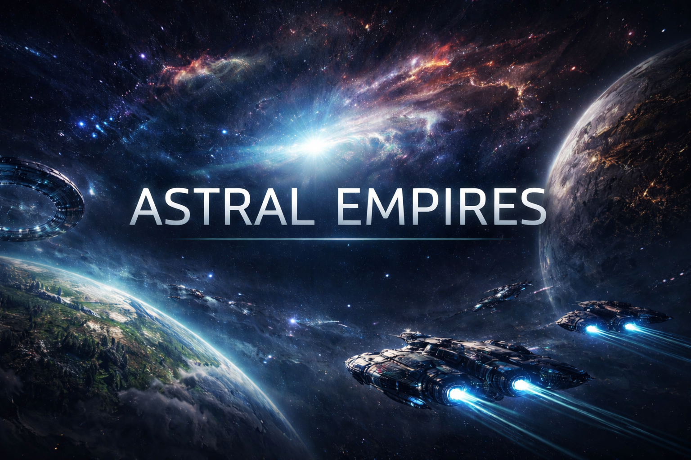

# Astral Empires



# # Astral Empires (Laravel CRUD + Blade + MySQL)

Acesta este un **proiect Laravel** (CRUD) cu pagini obișnuite pe Blade și cu vizualizarea hărții galaxiei/sistemului în stil Stellaris pe Three.js.

## Instalare
1) Instalați dependențele:
   ```bash
   composer install
   ```
2) Creați `.env`:
   ```bash
   cp .env.example .env
   php artisan key:generate
   ```
3) Configurați MySQL în `.env` (DB_DATABASE/DB_USERNAME/DB_PASSWORD).
4) Migrații + seeder:
   ```bash
   php artisan migrate --seed
   ```
5) Pornire:
   ```bash
   php artisan serve
   ```

## Rute principale
- `/` — meniul principal
- `/new-game/difficulty` — alegerea dificultății
- `/new-game/race` — alegerea rasei
- `/new-game/race/{race}/configure` — configurarea rasei
- `/new-game/galaxy` — configurarea galaxiei + generare
- `/galaxy/{galaxy}` — harta galaxiei
- `/system/{starSystem}` — ecranul sistemului

## Panou de administrare (CRUD)
- `/admin/races`
- `/admin/galaxies`
- `/admin/star-systems`
- `/admin/planets`
- `/admin/hyperlanes`

> Important: proiectul în arhivă este **fără folderul vendor/** (cum este de obicei în Laravel). După dezarhivare, pur și simplu rulați `composer install`.
